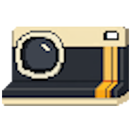
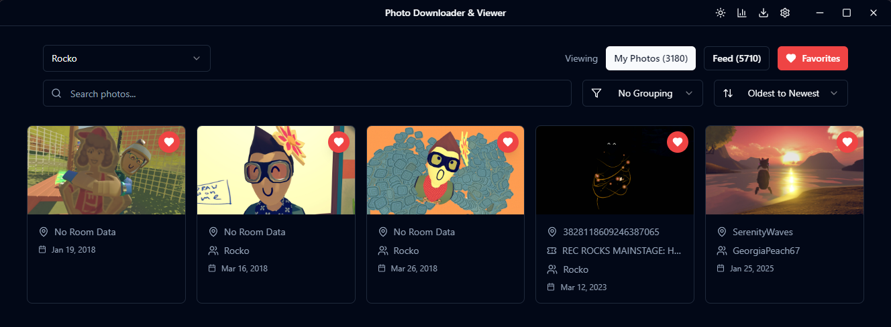
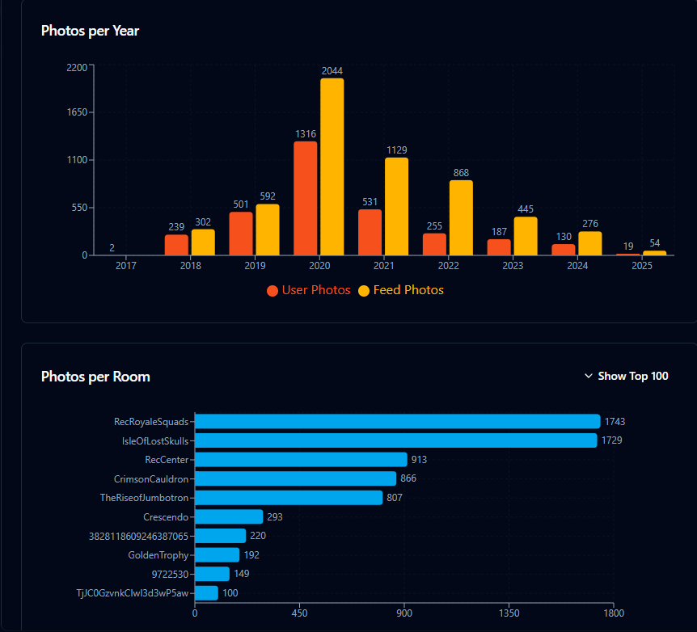

<div align="center">
  
</div>

# RR Image Downloader / Offline Viewer

This is an Electron + React desktop app for saving your Rec Room / RecNet images locally, browsing them offline, and exploring stats about your library.

In the event Rec Room doesn't exist. This application will allow you to download full resolution images of your image library and feed images from Rec Room's CDN. It will also capture important metadata about your images so you will still be able to view tagged users and the room the image was taken in. All while being offline and not connected to Rec Room's services.

**\*\*Use this application at your own risk. While Rec Room likely won't come after you it is in violation of their Terms of Service (ToS) to use. This application is deliberatly designed to be data efficient and relies on heavy caching and deduplication to make sure only neccessary data is downloaded. The requests made to Rec Room's services are throttled (configurable defaults to 0.5 seconds) so it shouldn not raise any red flags or result in an IP ban for your account.**\*\*

## Features

- Download and view images offline
- View unique stats about user images
- View images for multiple accounts
- Search images for images taken in a certain room or with a certain person
- Sort images by oldest to newest, newest to oldest, Most Popular (cheer count)
- Group images by Room, User, or Date
- Favorite images so they appear in an easy to find album

#### Favorite Photo Album

<div align="center">
   
</div>

#### View a variety of stats about a user's photos

<div align="center">

</div>

## Future Feature Ideas

- Fix images with missing room data (early 2017-2019 images miss this)
- If a image is taken in a subroom grab the main room name (otherwise we see the room ID and not the actual room name)

## Prerequisites

- Node.js 18+
- npm

## Setup

1. Install dependencies:
   ```bash
   npm install
   ```
2. Start the app in development (React + Electron):

   ```bash
   npm run dev
   ```

   - `npm run dev:react-only` starts just the renderer for UI work
   - `npm run dev:electron` runs Electron against the built assets

## Building installers

- Cross-platform build: `npm run build`
- Platform-specific: `npm run build:win`, `npm run build:mac`, `npm run build:linux`, or `npm run build:all`
- Output goes to `dist/` (packaged by electron-builder)

## Using the app (code version)

0. Install dependencies `npm install`
1. Launch the app (`npm run dev` or run a packaged build).
2. Click **Download**.
3. Enter the RecNet **username** to search for the account (the UI will confirm when it finds a match).
4. Choose an **Output folder** (default is `output`).
5. (Optional) Add an access **token** if you need private images:
   - Log in to https://rec.net in your browser.
   - Open Developer Tools (f12) > Network, refresh the page, and search for 'account/me'.
   - Copy the `Authorization` header value, remove the leading `Bearer `, and paste the token.
   - Tokens expire after a hour; grab a fresh one if validation fails.
6. Use **Force user data refresh** / **Force room data refresh** if cached info may be stale.
7. Click **Download**. Watch the progress panel; you can cancel mid-run if needed.
8. Browse results in the **image Viewer**:
   - Switch between images and Feed, change accounts, search, group, and sort.
   - Open a image for details and metadata.
9. Open **Stats** to see charts and summary metrics for the selected account.
10. Use the **Debug** menu (gear icon) to change the output path, adjust request delay, set a max download count for testing, and view logs/results.

## Using the app (downloadable executable)

1. Go to releases and download the executable for your OS.
2. Run the executable
3. Download images
4. Enjoy forever

## Data locations

- Downloads live under your chosen output folder (default `output`):
  - `<output>/<accountId>/images/` - downloaded profile images
  - `<output>/<accountId>/feed/` - downloaded feed images
  - `<output>/<accountId>/<accountId>_images.json` and `<accountId>_feed.json` - cached metadata
- App settings persist at `~/.recnet-photo-downloader/settings.json` (output path, delays, limits).

## Troubleshooting

- Validation errors or 401s: fetch a fresh token and ensure it matches the account you searched.
- Missing images: confirm the output path matches what the app is using and that the account is selected in the viewer.
- Rate limits or slow responses: increase the request delay in Debug > Settings.
- Stuck progress: cancel, reopen the Download dialog, and retry (cached metadata will speed things up unless you force refresh).

## License

MIT
