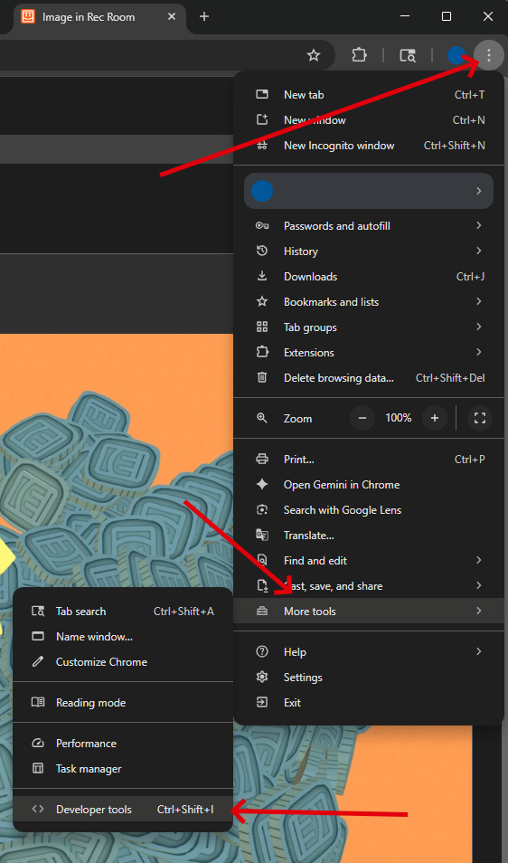
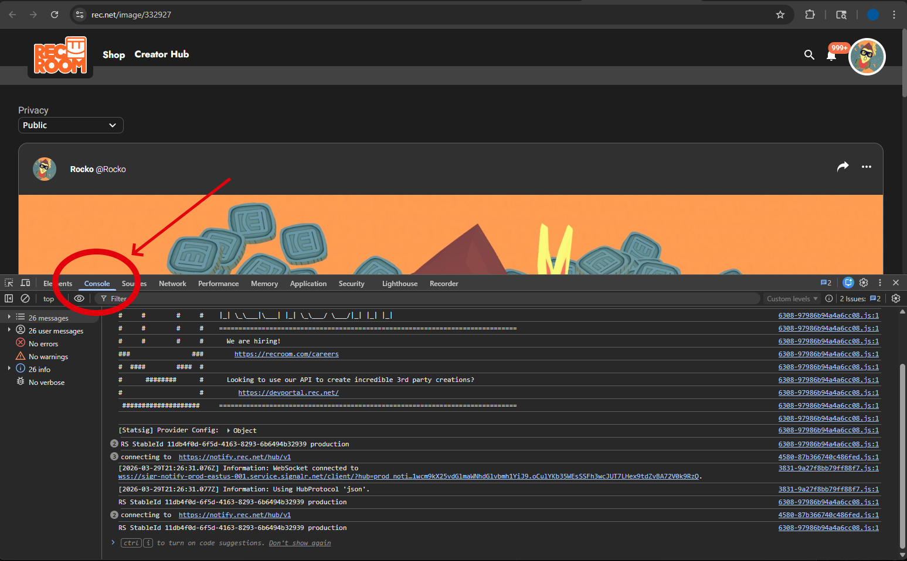
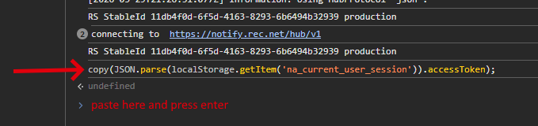
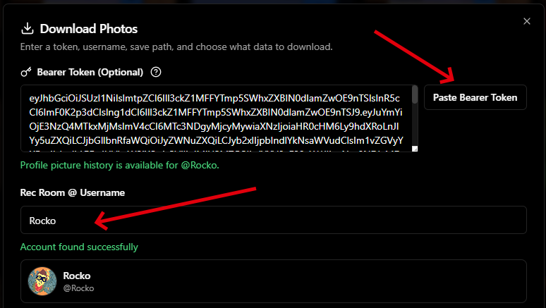

# How to Get Your rec.net Token

Use this guide if you want to download private photos or profile picture history in RR Image Downloader.

## Video Walkthrough

https://youtu.be/aEJrRHOrYDk?si=hCRcUmP4dEcDZCPn&t=227

## Before You Start

- Sign in to your rec.net account in a web browser.
- ALWAYS keep your token private.
- Tokens expire, so if the app says your token is invalid later on, just repeat these steps and get a fresh one.

### Step 1: Open rec.net in Chrome (images in this guide use Chrome), Edge, or Firefox

Sign in on `rec.net` and keep that tab open for the next steps.

### Step 2: Open the Browser Console

Stay on a rec.net page while signed in, then open the browser developer tools (press the **F12** key, or use the Chrome menu: three-dot menu → **More tools** → **Developer tools**).



Open the **Console** tab in the developer tools panel.



### Step 3: Paste This Command

Copy and paste this into the console, then press `Enter`:

```js
copy(JSON.parse(localStorage.getItem('na_current_user_session')).accessToken);
```

The command reads the current RecNet session from browser local storage and copies the `accessToken` value to your clipboard.



### Step 4: Allow Clipboard Access If Asked

Some browsers may ask for permission to copy to your clipboard.

If you see a permission popup follow what it says to enable it.

### Step 5: Go Back to RR Image Downloader

Return to the app and click:

`Paste Bearer Token`

Your token should appear in the token box automatically.



### Step 6: Finish the Setup

- Enter the matching Rec Room username.
- Choose your save folder.
- Select what you want to download.
- Start the download.
- Enjoy Forever

## Important Warning

Your token is private. Anyone who has it will be able to access your account data until the token expires.

Do not share it in screenshots, messages, streams, or videos.

## If It Does Not Work

Try these fixes:

- Make sure you are logged in on `rec.net`.
- Make sure you pasted the command into the browser console, not the address bar.
- Refresh the RecNet page and try again.
- If the token is old, get a new one by repeating the steps.
- If the clipboard does not fill automatically, run the command again and allow clipboard access.
